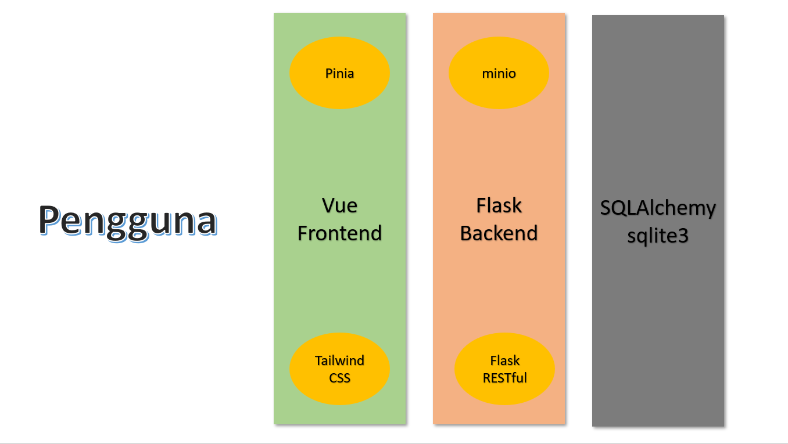
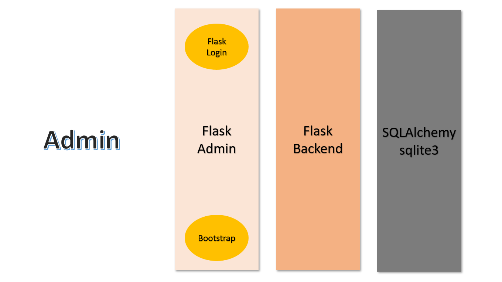
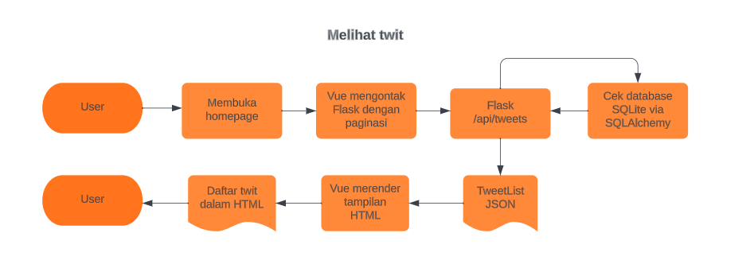
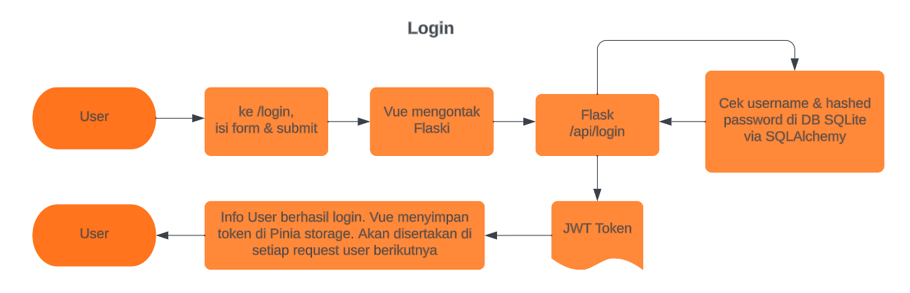
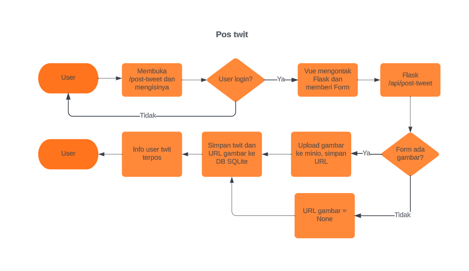

# Latar belakang
Membuat klon Twitter. Di sini kita namakan Klonx ("klon X"). Program ini akan mengemulasikan fitur-fitur yang ada di Twitter. Repo ini memuat bagian backend. Untuk bagian frontend (Vue), silakan lihat repo berikut: [atseira/pac05b-twitter_clone_vue: Webdev Architecture Pacmann - Twitter clone | Vue (github.com)](https://github.com/atseira/pac05b-twitter_clone_vue)
# Persyaratan
Program dibuat dengan backend Flask dan frontend Vue. Pengguna dapat mengirim twit dan/atau mengunggah foto untuk twit. Pengguna dapat memberikan like pada suatu twit dan ditampilkan jumlah like tiap twit. Untuk melakukannya, pengguna perlu login terlebih dahulu.
# Ilustrasi interaksi antarmuka
Pengguna biasa bisa berinteraksi dengan aplikasi web melalui frontend Vue. Vue akan mengakses endpoint yang relevan yang disediakan oleh Flask Backend via Flask RESTful (API seperti REST API). Database yang digunakan untuk tahap development ini adalah sqlite3 yang diakses oleh Flask via SQLAlchemy.

Untuk pengguna admin, bisa mendapatkan akses langsung ke Flask via Flask-Admin. Ini merupakan fitur untuk mempercepat tampilan admin sederhana yang biasa digunakan.

Program ini juga dikemas menggunakan Docker. File docker-compose terletak pada repo ini.
# Alur program
Sebuah kloning aplikasi web Twitter bernama `klonx`. Pengguna berinteraksi dengan frontend `Vue` sementara `Vue` berinteraksi dengan backend `Flask` lewat API `Flask-RESTful`. 
Pengguna dapat melakukan:
- melihat twit tanpa perlu login
- login

Setelah login, dapat melakukan:
- post tweet dengan/tanpa gambar
- memberi like
- membatalkan like
- logout

Untuk fitur-fitur lain, belum ditampilkan diagram alurnya di dokumen ini. Diagramnya kurang lebih cukup mirip dengan sebelum-sebelumnya, hanya ada beberapa kasus if-else yang perlu dievaluasi jika user sudah login atau user sudah memberikan like/belum.

